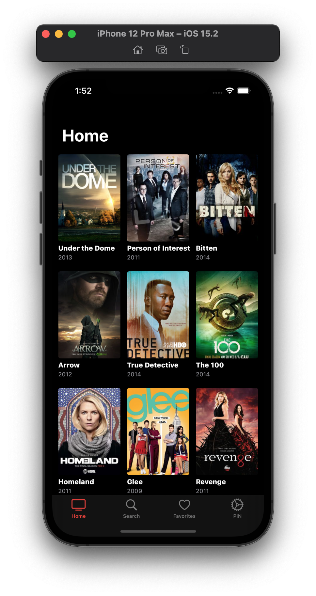
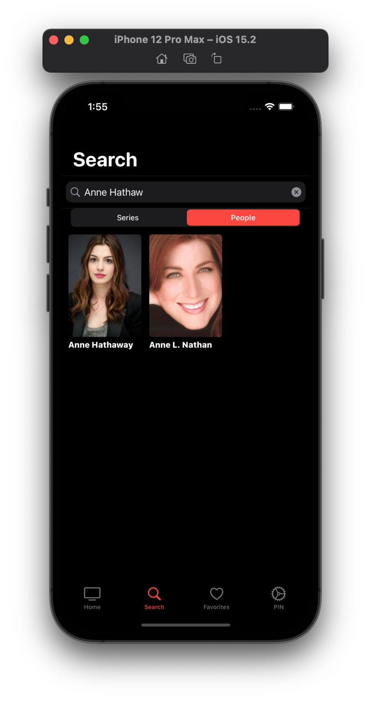
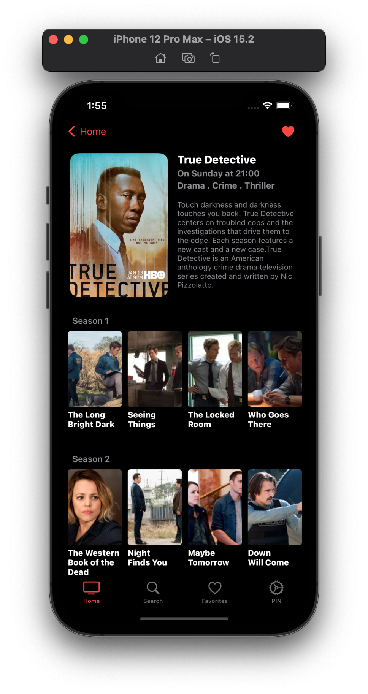

# TVMaze
## Jobsity iOS Challenge

**Overview**

TVMaze app uses the API to fetch shows index, search for series and people and preview details.

`MVVM-C` is the architectural design pattern used. App uses `RxSwift` for Reactive Programming to build the search feature.

Favorties series are stored in DB managed by `Realm`.

PIN feature is supported by 3rd party dependency named `AppLocker` with few code modifications.

## Installation

1. Clone Repository

```
git clone https://github.com/ygapps/TVMaze.git
```

2. Install Swift Package Dependencies

```
Xcode > File > Packages > Resolve Package Versions
```

3. Run App


<p float="left">



</p>